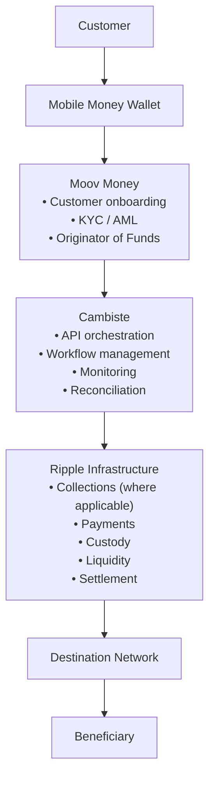

# Ripple Reference Architecture for Mobile Money Operators

**Draft v1 – Cambiste Proposal**

## Executive Summary

Cambiste is building a standardized integration model enabling African Mobile Money Operators to offer compliant international payments directly from their existing Mobile Money platforms.

Our objective is to combine Ripple's payment infrastructure with Cambiste's orchestration layer, allowing Mobile Money Operators to launch cross-border payment services without building or operating their own digital asset infrastructure.

This document is intended to validate the target operating model with Ripple.

---

## Business Problem

Today, Mobile Money Operators face several barriers when offering international payments:

- Limited access to international payment infrastructure.
- Regulatory complexity for cross-border settlement.
- High operational costs of correspondent banking.
- Requirement to maintain foreign settlement infrastructure.

Ripple provides the financial infrastructure required to solve these challenges.

Cambiste provides the Mobile Money integration layer.

---

## Proposed Value Proposition

**International Payments for Mobile Money Operators – Powered by Ripple**

Mobile Money customers should be able to send international payments directly from their Mobile Money wallet while experiencing the same simplicity as a domestic Mobile Money transfer.

The end user should never interact with:

- Blockchain
- Stablecoins
- Digital asset wallets
- Private keys
- Custody infrastructure

These components remain entirely within the underlying Ripple infrastructure.

---

## Target Operating Model

| Party | Responsibility |
| --- | --- |
| **Mobile Money Operator (Moov)** | Customer relationship, KYC/AML, wallet management, payment initiation (Originator of Funds). |
| **Cambiste** | Technical Service Provider (API integration, orchestration, monitoring, reconciliation and implementation support). |
| **Ripple** | Cross-border payment infrastructure, liquidity management, settlement and custody (target operating model). |
| **Destination Partner** | Final payout to beneficiary. |

Cambiste does **not** intend to operate as:

- Payment Service Provider
- Custodian
- Digital Asset Wallet Provider
- Financial Institution

Cambiste acts exclusively as the technology integration layer.

---

## Reference Architecture

**Flow summary:**

1. **Customer** initiates a payment from their **Mobile Money Wallet**.
2. **Moov Money** handles customer onboarding, KYC/AML, and acts as Originator of Funds.
3. **Cambiste** provides API orchestration, workflow management, monitoring, and reconciliation.
4. **Ripple Infrastructure** provides collections (where applicable), payments, custody, liquidity, and settlement.
5. The **Destination Network** delivers the payout to the **Beneficiary**.

---

## Key Architecture Principles

1. The Mobile Money Operator remains the Originator of Funds.
2. Cambiste remains exclusively the Technical Service Provider.
3. Ripple (or a Ripple-designated regulated custodian) provides the custody layer for digital assets used during settlement.
4. Mobile Money Operators should not be required to build or operate their own blockchain infrastructure.
5. The solution should eliminate the need for international pre-funded settlement accounts wherever supported by Ripple's payment model.

---

## Meeting Objectives

The purpose of this meeting is to validate the following points:

1. Is this the recommended Ripple architecture for Mobile Money Operators?
2. Can Ripple provide the custody layer (or designate a regulated custodian) so that neither Moov nor Cambiste holds private keys or assumes custody responsibilities?
3. Which Ripple products constitute the recommended solution for this use case?
4. Which Ripple legal entity contracts with the Mobile Money Operator and assumes responsibility for the settlement infrastructure?
5. What partnership model does Ripple recommend for Cambiste as the Mobile Money integration partner?

---

## Vision

Cambiste's ambition is to become Ripple's preferred Mobile Money integration partner across Africa.

By combining Ripple's financial infrastructure with Cambiste's Mobile Money expertise, operators will be able to deploy compliant international payment services significantly faster while remaining focused on customer acquisition, compliance and local operations.
