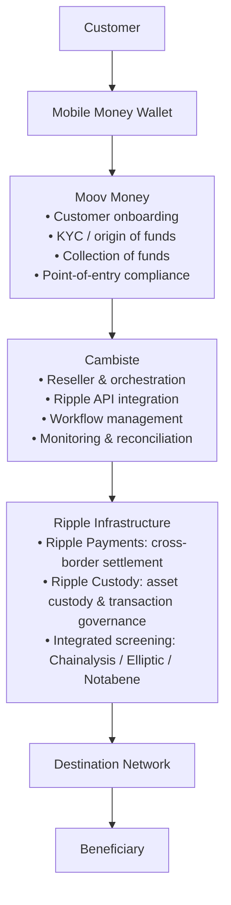

# Cambiste × Ripple Mobile Money Reference Architecture

**Draft v2 – Cambiste Proposal** · *Executive summary document (3 pages)*

## Executive Summary

Cambiste is building a standardized integration model enabling African Mobile Money Operators to offer compliant international payments directly from their existing Mobile Money platforms.

Cambiste is not seeking to become a financial institution that carries the risk. Cambiste is building a **distribution and orchestration layer**:

- **Ripple** provides the institutional infrastructure (payments, custody, settlement).
- **Mobile Money Operators** retain their customer relationship and their obligations at the point of entry.
- **Cambiste** connects the two, industrializes the integration and accelerates deployment.

This value proposition is designed to fit Ripple's **Reseller Partnerships** program. The purpose of this document is to validate the target operating model with Ripple.

---

## Value Proposition

**International Payments for Mobile Money Operators – Powered by Ripple**

Mobile Money customers send international payments directly from their Mobile Money wallet, with the same simplicity as a domestic transfer. The end user never interacts with blockchain, stablecoins, digital asset wallets, private keys or custody infrastructure — these components remain entirely within the underlying Ripple infrastructure.

---

## Roles and Responsibilities

| Actor | Responsibility |
| --- | --- |
| **Moov Money** (Mobile Money Operator) | Customer relationship, KYC, collection of funds, verification of the origin of funds and compliance applicable at the point of entry. |
| **Cambiste** | Reseller, technical orchestration, integration of Ripple APIs, workflow management and support for Mobile Money Operators. |
| **Ripple Custody** | Digital asset custody infrastructure, transaction governance, validation policies, integration of compliance controls and execution of custody operations. |
| **Ripple Payments** | Cross-border settlement and settlement orchestration. |
| **Chainalysis / Elliptic / Notabene** | Transaction screening, sanctions screening and Travel Rule, integrated into the infrastructure. |

Cambiste does **not** operate as a Payment Service Provider, Custodian, Digital Asset Wallet Provider or Financial Institution. Cambiste acts exclusively as the technology integration and distribution layer.

---

## Reference Architecture

**Transaction journey:**

1. The **customer** initiates an international payment from their Mobile Money wallet.
2. **Moov Money** performs KYC, verifies the origin of funds, collects the funds and applies point-of-entry compliance.
3. **Cambiste** orchestrates the transaction through Ripple's APIs (workflow, monitoring, reconciliation).
4. **Ripple Payments** executes cross-border settlement; **Ripple Custody** governs and executes the underlying digital asset operations; **integrated screening providers** (Chainalysis / Elliptic / Notabene) perform transaction, sanctions and Travel Rule screening.
5. The **destination network** delivers the payout to the beneficiary.

---

## Compliance and Custody Governance

Ripple Custody automates a large part of the compliance controls (validation policies, integrated screening). However, when a transaction is flagged, a **human review is required**. The final decision therefore rests with the **regulated entity operating that infrastructure**, in accordance with its contractual and regulatory framework.

Publicly available documentation does not, on its own, identify which legal entity (Ripple, a subsidiary, or a partner) assumes this responsibility in every deployment. **This is a key point to validate contractually with Ripple** — the term "final responsibility" is deliberately not used in this document until that allocation is confirmed.

---

## Key Architecture Principles

1. The Mobile Money Operator remains the Originator of Funds and owns point-of-entry compliance.
2. Cambiste remains exclusively the technical orchestration and distribution layer (Reseller).
3. Ripple (or a Ripple-designated regulated custodian) provides the custody layer; neither Moov nor Cambiste holds private keys or assumes custody responsibilities.
4. Mobile Money Operators are not required to build or operate blockchain infrastructure.
5. The solution eliminates the need for international pre-funded settlement accounts wherever supported by Ripple's payment model.

---

## Points to Validate with Ripple

1. Is this the recommended Ripple architecture for Mobile Money Operators?
2. Which Ripple legal entity operates the custody and compliance infrastructure, and assumes the associated regulatory responsibility, in this deployment?
3. Which Ripple products constitute the recommended solution (Ripple Payments, Ripple Custody, integrated screening)?
4. Which Ripple legal entity contracts with the Mobile Money Operator?
5. Is the **Reseller Partnerships** program the recommended partnership model for Cambiste as the Mobile Money integration partner?

---

## Vision and Next Steps

Cambiste's ambition is to become Ripple's preferred Mobile Money integration partner across Africa, enabling operators (Moov, Wave, Orange Money, Airtel Money, etc.) to deploy compliant international payment services significantly faster while remaining focused on customer acquisition, compliance and local operations.

Following validation of this model, Cambiste will produce a full executive document (10–15 pages) covering: detailed roles and responsibilities, the complete transaction journey, the compliance matrix, the business model (including Cambiste's 0.5% commission), operator use cases, and the value proposition for Ripple and for the operators — as the primary support for discussions with the Reseller Partnerships team and future operator partners.
