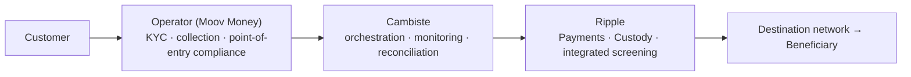

# Cambiste × Ripple — Unlocking Mobile Money for Cross-Border Payments

**Partnership proposal – Draft v3** · *3 pages · Prepared for Ripple Reseller Partnerships*

---

## 1. The Opportunity Ripple Cannot Capture Alone

Mobile money **is** the banking system of Africa:

- **800M+ registered mobile money accounts** in Africa; Sub-Saharan Africa processes **~$900B in annual transaction value** — roughly two-thirds of the global total (GSMA, State of the Industry).
- **~$90B in annual remittance flows to Africa**, at the **highest average cost in the world (~8% to Sub-Saharan Africa** vs. the 3% UN SDG target — World Bank).
- Yet mobile money wallets **stop at the border**: international send/receive remains fragmented, expensive, and dominated by legacy corridors.

Ripple has the institutional infrastructure — payments, custody, liquidity, integrated compliance. Mobile Money Operators have the customers, the KYC, and the last mile. **What is missing is the industrial connection between the two.**

Today, connecting each operator to Ripple means a bespoke integration: heterogeneous legacy platforms, thin technical teams, long procurement cycles. Operator by operator, that does not scale. **That is the gap Cambiste closes.**

## 2. What Cambiste Brings Ripple

Cambiste is not another fintech asking Ripple for infrastructure. Cambiste is a **distribution and orchestration layer** that turns one Ripple integration into many operator deployments.

| Ripple's problem | Cambiste's answer |
| --- | --- |
| Each Mobile Money Operator is a slow, bespoke integration | **One orchestration layer, built once, replicated across operators** (Moov first; Wave, Orange Money, Airtel Money as expansion targets) |
| Operators won't build or operate digital asset infrastructure | **Operators never touch it** — blockchain, stablecoins, keys and custody stay entirely inside Ripple's infrastructure |
| Risk and licensing ambiguity kills deals | **Clean allocation by design**: the operator keeps point-of-entry compliance, Ripple's regulated infrastructure keeps custody and settlement, Cambiste stays a pure technology reseller |
| Market access requires local presence and trust | **Cambiste brings Mobile Money domain expertise and operator relationships across Francophone and Anglophone Africa** |

**The end-customer experience is the product:** an international transfer that feels exactly like a domestic mobile money transfer. No wallet to install, no crypto to see, no new habit to learn — which is why operator-embedded distribution beats every standalone remittance app fighting for downloads.

**Every live corridor is recurring settlement volume on Ripple Payments.** Cambiste's success is measured in Ripple's transaction flow.

## 3. The Model on One Page

| Actor | Responsibility |
| --- | --- |
| **Mobile Money Operator** (e.g. Moov Money) | Customer relationship, KYC, collection of funds, verification of origin of funds, point-of-entry compliance. Originator of Funds. |
| **Cambiste** | Reseller and technical orchestration: Ripple API integration, workflow management, monitoring, reconciliation, operator enablement. |
| **Ripple Custody** | Digital asset custody, transaction governance, validation policies, execution of custody operations. |
| **Ripple Payments** | Cross-border settlement and settlement orchestration — no pre-funded international accounts where Ripple's model supports it. |
| **Chainalysis / Elliptic / Notabene** | Transaction screening, sanctions screening, Travel Rule — integrated into the infrastructure. |

**Transaction journey:** the customer initiates from their wallet → the operator applies KYC and collects funds → Cambiste orchestrates via Ripple APIs → Ripple settles cross-border with custody and screening handled inside its infrastructure → the destination partner pays out the beneficiary. **Neither the operator nor Cambiste ever holds private keys or digital assets.**

## 4. Business Model — Aligned Incentives

- The end customer pays a transfer fee **at or below existing corridor pricing** — the cost advantage comes from removing correspondent banking and pre-funding.
- **Cambiste earns a 0.5% orchestration commission** per transaction — it earns only when volume flows.
- **Ripple monetizes payments, custody and liquidity** under its reseller pricing model.
- **The operator takes a distribution margin** on a product it launches in weeks instead of years, on infrastructure it never has to build.

Everyone in the chain is paid on the same event: a successful cross-border transaction. No integration fees standing between Ripple and volume.

## 5. Compliance by Design — and One Question We Raise Ourselves

Screening (Chainalysis / Elliptic / Notabene) is automated inside the infrastructure; flagged transactions require human review. That review — and the final decision — belongs to the **regulated entity operating the custody infrastructure**, under its contractual and regulatory framework. Public documentation does not identify which legal entity (Ripple, a subsidiary, or a partner) assumes this in every deployment.

We raise this ourselves because operators' regulators will ask it first, and because a partner who maps the risk before signing is a partner who deploys faster after signing.

## 6. What We Ask of Ripple

1. **Validate the architecture** above as the recommended Ripple model for Mobile Money Operators.
2. **Confirm the custody model**: Ripple (or a Ripple-designated regulated custodian) holds the custody layer — neither the operator nor Cambiste touches keys or assets.
3. **Name the contracting entities**: which Ripple legal entity contracts with the operator, and which operates the custody and compliance infrastructure.
4. **Admit Cambiste into the Reseller Partnerships program**, with sandbox access and reseller pricing.
5. **Launch a 90-day pilot with Moov Money on one corridor**, then replicate the playbook across the operator pipeline.

**Cambiste's ambition is simple: to become Ripple's Mobile Money distribution partner for Africa — one integration, many operators, recurring volume.** The pilot proves it in one quarter.
